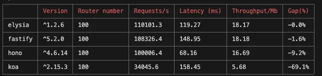

# 动机

- 验证各个框架在nodejs、bun中不同route数量的性能表现
- 验证routing-controlles对性能的损耗

通过各项对比，选择适合自己的方案

# 使用

第一步：clone项目
```
git clone
```

第二步安装依赖
```
pnpm install
```

第三步运行命令
```
node src/index.js
```

参数
- 第一个参数：设置routes数量，可以是1、100、1000
- 第二个参数：设置运行平台，可以是node、bun（注意运行之前确认本机已安装好node或者bun）
- 第三个参数：设置是否在routing-controllers下运行

```
node src/index.js 1000 bun

OR

node src/index.js 1000 bun true
```

结果如下所示




